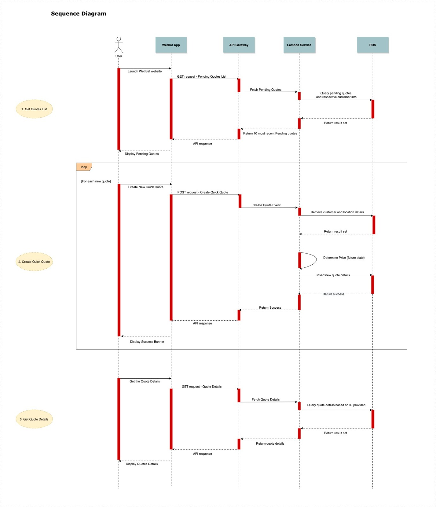

# Wet Bat Travel

Demo - https://mekhalajoshi.github.io/launchcode-Developer-Challange/

## Technologies
Project is created with:
* ReactJs
* Material UI React 
* AWS API Gateway
* AWS Lambda
* AWS RDS
* MySQL


## How it Works
Frontend : 
The front-end web application is built with React. It uses React Redux for state management and Material UI web components. The dashboard has a grid layout and is responsive. React router is used to navigate to between components.

Backend:
The back-end is built on AWS's serverless architectures. It uses the following AWS services; AWS RDS, AWS Lambda, AWS API Gateway. 
          <p align="center">
            
          </p>

The Serverless Architecture uses AWS Lambda in conjunction with Amazon API Gateway, Amazon RDS(MySQL), to build the backend of the application.
I have also included the .yaml document for the API and the Node.js files for the Lambda functions.

## Database Schema
The following is the databse schema of the Quotes-Service
            <p align="center">
              
            </p>
## Tables
**quotes:** The quotes table stores information about quotes. When an agent creates a quote on the front end the quote gets stored in this table. One quote can have multiple travel or transportation invoices(multi city travel or staggered travel dates). 

**customer_contact_information:** It is assumed that all quotes are created for customers who are already registered. When customers get registered with the system, their contact information is stored in this table.

**locations:** This table stores a list of all possible locations to fly in and out of. Currently it has been pre-populated with a few cities, but it can be loaded with a list of airports moving forward.

**travel_invoice:** This table stores information related to customer travels and invoices. One quote may have multiple travel invoices for multi city travels.

**transportation_invoice:** If a customer chooses to use additional transportation services, that information is stored in this table.

**transportation_type:** This is a list of all possible transportation services, rental car, taxi, shuttle etc.

**agents:** The contact information of all back office agents who use the dashboard is stored in the agents table.

## Workflows
Workflow diagram from the app -
             <p align="center">
              
            </p>
**1. Getting a list of all quotes:** When the quotes component is loaded the pending quotes card is populated with a list of the 10 most recent quotes posted by the agent.

**2. Posting a quote:** When a quote is created on the frontend, it is stored in the quotes table. It is assumed that another service will calculate the price of that quote. For the porposes of this challange it has been defaulted to 1000.00. The information of the agent posting the quote is also hardcoded.

**3. Getting Quote Details:** Clicking on a perticular quote in the pending quotes table opens a Detailed view of the quote. It includes information of all travel services, transportation services as well as contact information of the customer.

## Assumptions
* All customers requesting Quotes are already registered and their contact information is stored in the database. 
* Location fields are mocked with pre-populated city names. 
* “Transportation during travels” field is pre-populated with mocked values.
* Price of the quote needs to be determined by another backend service (out of scope for this MVP) that populates the price in quotes table, travel invoices table and transportation invoices table (if any).  
* pick-up / drop-off locations in transportation invoices are the same as in the quote table invoices.
* The schema for all transportation services like shuttles, taxies or rental cars are assumed to be the same.
* A single quote may have multiple travel invoices (multi-city travel).

## Moving forward..
* Add a detailed quotes form where a back office agent can create a quote and register new customers in the same form.
* Pre populate the front end locations field and the backend locations tables using with names of Airports from another API.
* Additional services like hotel stays can be added with minimal changes to the current database schema.
* When an agent signs-in, session and agent inofrmation needs to be saved in the quotes table for troubleshooting and auditing purposes.
* Integrate a price service to calculate prices of quotes for travel and transportation services.


## Setup
### UI
To run this project clone this repo and navigate to the  navigate to /frontend/wet-bat-dashboard. To run it locally using npm,
```
$ npm install
$ npm start
```
Then navigate to "https://localhost:3000" to view app on the browser.

### Database
* [Create an AWS account.](https://aws.amazon.com/) Create and setup an AWS RDS MySql instance with your AWS account. 
* [Download the MySQl workbench](https://www.mysql.com/products/workbench/) Connect the RDS instance to the MySql workbench. 
* Use the file in the backend/db_schema folder to create the database schema in the workbench [as shown here.](https://www.mysql.com/products/workbench/migrate/)

### API 
* [Create or Sign-in to you AWS account.](https://aws.amazon.com/)
* Navigate to API Gateway and Create a new REST API
* Click the Build option and select "Import from Swagger or Open API 3" option 
* Upload the swagger documentation from /backend/swagger doc folder

### Lambda
* [Create or Sign-in to you AWS account.](https://aws.amazon.com/)
* Navigate to Lambda and create a new lambda function
* Zip and upload the /backend/launchcode-quotes-service folder to the new lambda function
